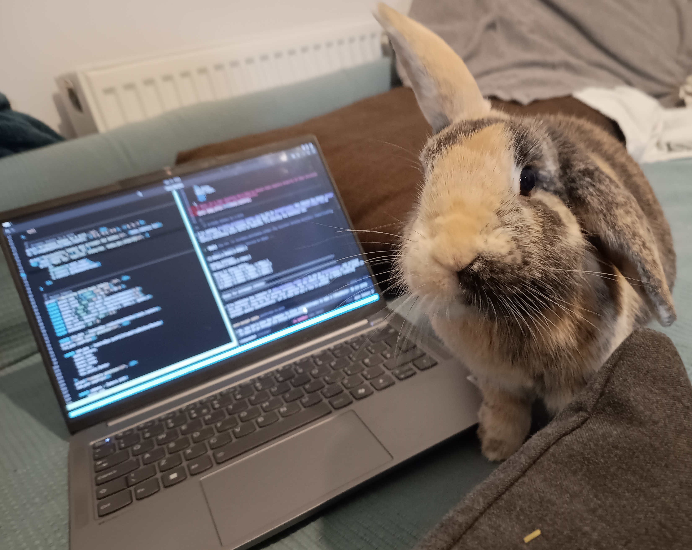

# Riley
`Riley` is a performant software rasteriser written in Zig specifically designed for digital image correlation (DIC) uncertainty quantification (UQ). `Riley` performs off-line rendering of deformed speckle pattern images from an input finite element simulation. `Riley` supports accurate rendering of higher order finite elements including `tri3`, `tri6`, `quad4`, `quad8` and `quad9` surface elements. Texture shading with higher order texture sampling is also supported for accurate speckle pattern rendering including: cubic sampling (Catmull-Rom, Mitchell-Netravali, BSpline), quintic sampling (BSpline) and Lancsoz (lancsoz3). Rendering multiple meshes with different element types and shading strategies in the same scene is supported.

We specifically chose to implement `Riley` in Zig as it is a compiled language with manual memory management. It also allows for compile time code generation and has excellent support for SIMD vector types. We have used `comptime` to generate speciliased kernels for geometry and shader types removing run time dispatch overhead. We have also leveraged Zig's `io` interface to implement hierarchical parallelisation allowing for inter and intra frame parallelisation for offline rendering.

## Getting Started: Zig
`Riley` uses the Zig 0.16.0 compiler release which can be downloaded from [here](https://ziglang.org/download/). The `Riley` repository contains a minimal set of regression tests (called the "min" test suite) which should be run before generating a wider set gold regression data and running performance benchmark suites. The min test suite can be run from the project root directory using:
```shell
zig test -lc -O ReleaseSafe ./src/test_min.zig
```
The min test suite contains two cases a render of the "multimesh" case which is two elements of each type in a single scene that are rendered with nodal interpolation shading or texture shading. The min test suite also contains a rendering of the "sphere200" case which is a sphere with 200 elements of a single type with every possible combination of nodal or texture shading. the sphere200 case is particularly sensitive to breaking changes due to the range of element orientations.

Once the min test suite passes the additional gold regression data can be generated for two suites the first is the "all" suite and the second is the "bench" suite. The "bench" suite is based on the benchmarks described in the "Benchmarks" section below. Before we can render the gold images we first need to generate the larger meshes for the "bench" cases using a python script that has numpy as a dependency, run this from the project root:
```shell
python ./data/bench/gen_bench_data.py
```

You should see a range of directories generated in the data/bench directory with different element types and case tags. Once that is done we can render the required gold output with:
```shell
zig run -lc -O ReleaseSafe ./src/gen_gold_all.zig
```

Now we can run the remaining "all" and "bench" test suites:
```shell
zig test -lc -O ReleaseSafe ./src/test_gold_all.zig
zig test -lc -O ReleaseSafe ./src/test_bench.zig
```

## Getting Started: Python
We provide python bindings for the `Riley` dynamic library through cython. We also provide a `riley-raster` python package on pypi which builds `Riley` from zig source using the `ziglang` python package. You can install `Riley` into a python virtual environment using:

```shell
pip install riley-raster
```

Note that as this builds `Riley` from source on your local machine the install will take approximately 1 minute or more depending on your hardware. For all demonstration zig scripts described below we provide python equivalents in the ./pyscripts/ directory in the project root. You can also create an editable install by directly building from source on your local machine. Clone the `Riley` repo, create a python virtual environment of your choice and then with your environment active run the following from the project root:

```shell
pip install -e .
```

## Capability Demonstration
We have included a series of capability demonstrations scripts in the /src/ directory (or in the /pyscripts/ directory for python versions). In Zig, these can be run using
```shell
zig run -lc -O ReleaseFast ./src/demo_CASE.zig
```
where CASE is the name of the demonstration script you want to run (CASE = sphere200, rabbits, dicuq, stereocal). The output renders will be saved to /out/demo-CASE/.

In python you should activate your virtual environment with `Riley` installed then you can run the examples using:

```shell
python ./pyscripts/demo_CASE.py
```

where CASE is the name of the demonstration script you want to run. The output renders will be saved to /pyout/demo-CASE/.

### Speckle Sphere
For this demonstration we import a mesh of sphere and apply a speckle pattern texture shader to render a speckle pattern on the sphere. This is a simple single mesh and single shader case that would be typical for a DIC UQ workflow. A representative render of the sphere is shown below:


### Rendering Rabbits
In this demonstration we render a series of rabbit meshes that are composed of all supported element types: `tri3`, `tri6`, `quad4`, `quad8` and `quad9`. We also demonstrate the usage of all support shader types in the same scene rotating between a texture shader with cubic LUT-lerp sampling, a nodal interpolation shader interpolating the uv coordinates and an analytic function shader producing a sin wave pattern across the rabbit mesh based on the input uvs. The output render is shown below, the top row are the triangular meshes and the bottom row are the quadrilateral meshes:


### Digital Image Correlation Uncertainty Quantification
For this case we demonstrate a representative DIC UQ rendering using an input finite element model of a plate with a hole loaded in tension imaged by a stereo DIC system consisting of two 5MPx cameras. The simulation mesh was generated with Gmsh and solved using the MOOSE solid mechanics module. The gmsh .geo and MOOSE .i input file can be found in the /data/FE/ directory.

| Camera 0 | Camera 1 |
|:---:|:---:|
|  |  |


### Stereo Calibration
We now use the camera setup from the previous DIC UQ demo, import it and then render a series of stereo calibration target images with the same camera setup. The input meshes for this case can be found in the /data/calplate/ directory. In this directory there is a python script which can be used to scale the size of the calibration target mesh and to generate different combinations of rigid body translation and rotation within user specified bound. A representative render is shown below:

| Camera 0 | Camera 1 |
|:---:|:---:|
|  |  |


## Performance Benchmarks
We used four cases to analyse the performance of `Riley`: 1) Minimum elements filling the screen (2 triangles or 1 quadrilateral), called "fullraster", 2) 1e5 elements filling screen, called "geom", 3) A sphere in the centre of the screen with 2000 elements, called sphere2000. Case 1 is intended to test the throughput of the raster hot loop. Case 2 is intended to test the throughput of the geometry pre-processing. Case 3 is a more realistic case with a balance of element orientations. Case 4 tests thread scaling on the same case as the DIC UQ demonstration. These benchmark suites can be run using:

```shell
zig run -lc -O ReleaseFast ./src/bench_fullraster.zig
zig run -lc -O ReleaseFast ./src/bench_geom.zig
zig run -lc -O ReleaseFast ./src/bench_sphere2000.zig
zig run -lc -O ReleaseFast ./src/bench_dicuq.zig
```
You will find the rendered output for these benchmarks in ./out/bench-CASE where CASE is fullraster, geom, sphere2000 or dicuq.

## Navigating the Codebase
The main entry point for the `Riley` rendering pipeline is the `rasterAllFrames` function in /src/riley/zig/riley.zig.

### C Interface

`Riley` provides a small C-compatible API for use from other languages. The Python bindings use this interface through Cython, but it can also be called from C or from languages with C FFI support. The extern types and functions for this interface can be found in /src/riley/zig/c-riley.zig. 

## Contributors
- Lloyd Fletcher ([ScepticalRabbit](https://github.com/ScepticalRabbit)), UK Atomic Energy Authority
- Joel Hirst ([JoelPhys](https://github.com/JoelPhys)), UK Atomic Energy Authority
- Wiera Bielajewa ([WieraB](https://github.com/WieraB)), UK Atomic Energy Authority

## Dedication

Named in memory of Riley, and for Feebee, her sister and bondmate. Without your love and support, this project would never have happened.


